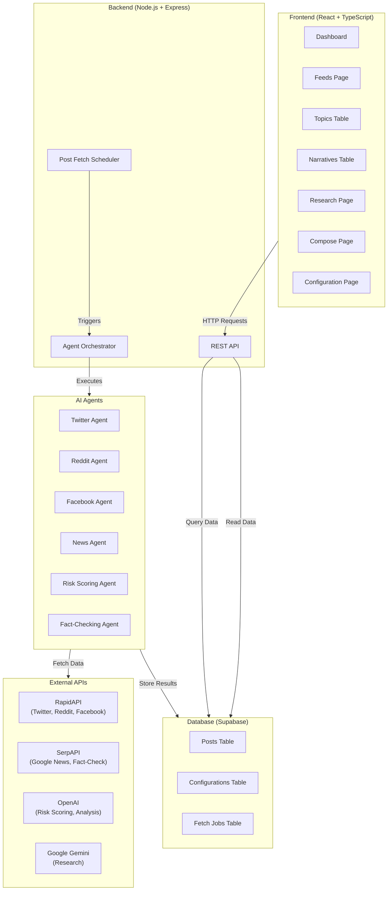
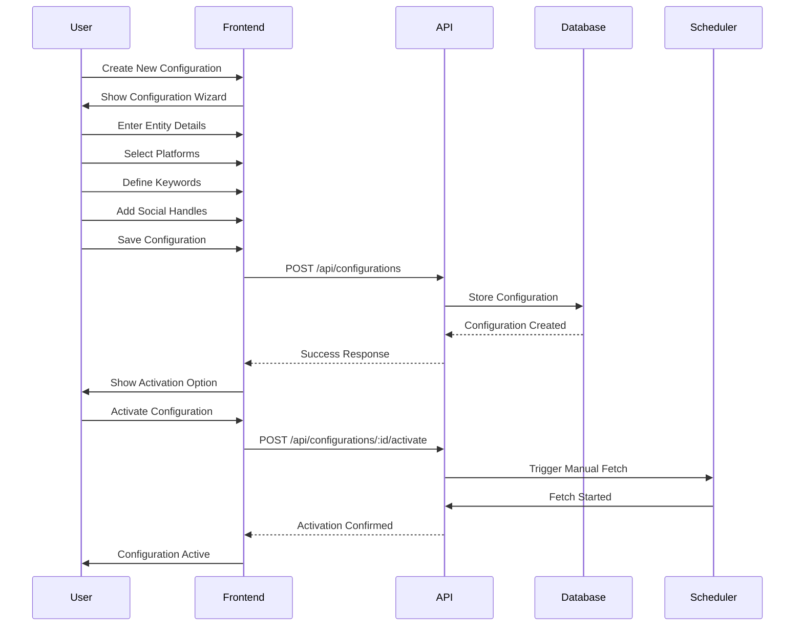
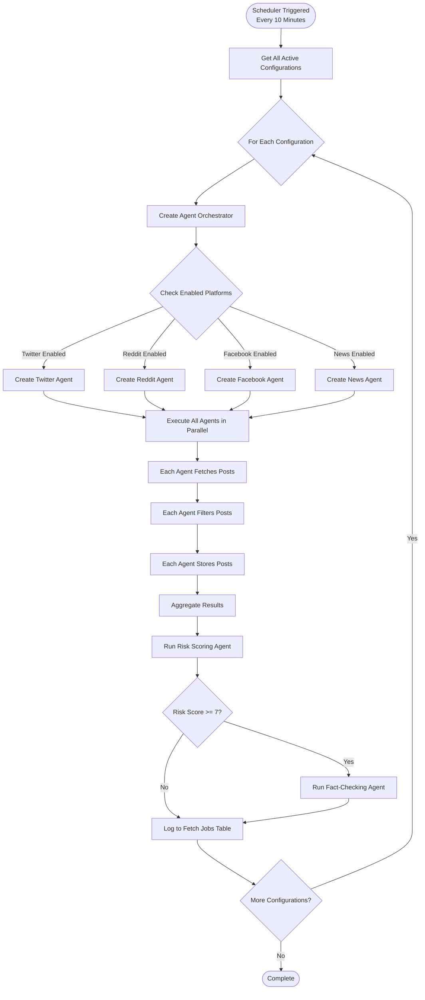
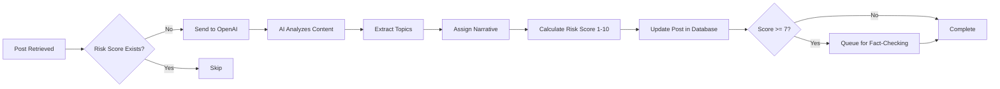
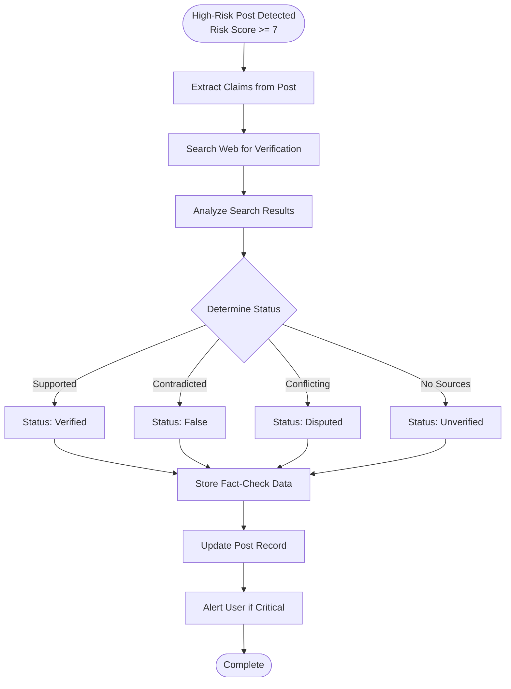
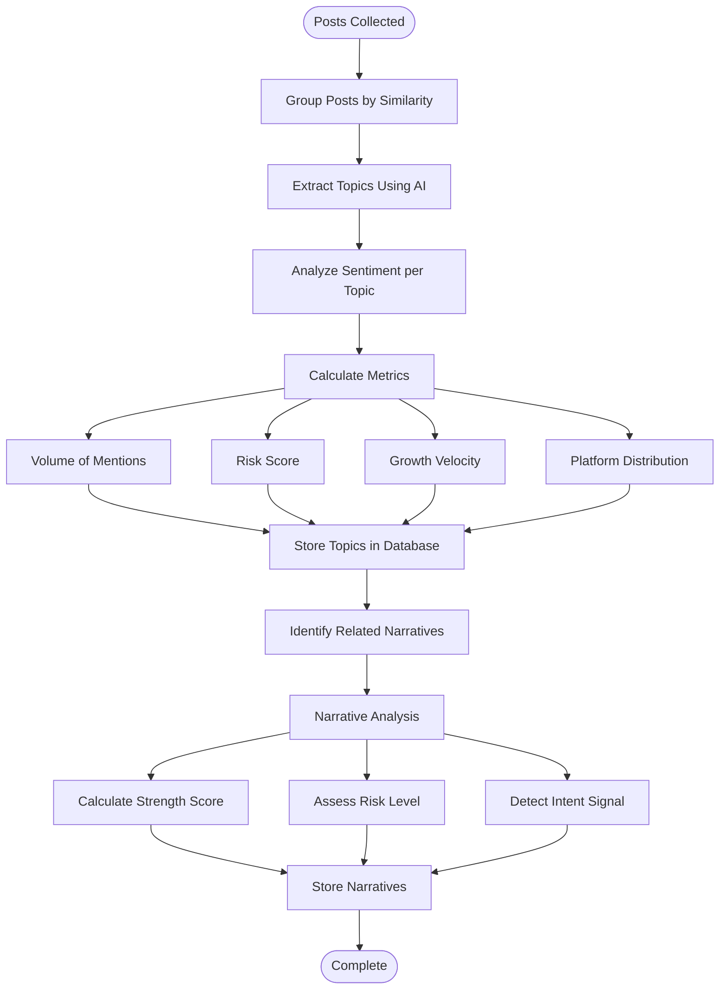

# RepuShield v7 - Comprehensive Feature Documentation

## Executive Summary

**RepuShield** is an AI-powered reputation monitoring and management platform that automatically tracks, analyzes, and provides actionable insights on how your brand, organization, or public figure is being discussed across multiple online platforms. The system continuously monitors social media, news outlets, and forums to identify potential reputation risks, sentiment trends, and emerging narratives before they escalate into crises.

### Key Value Propositions

- **Proactive Risk Detection**: Identify reputation threats in real-time with AI-powered risk scoring (1-10 scale)
- **Multi-Platform Monitoring**: Simultaneously track Twitter, Reddit, Facebook, and News outlets
- **Automated Fact-Checking**: AI verifies claims in high-risk posts to prevent misinformation spread
- **Intelligent Topic Extraction**: Automatically identifies and groups related discussions into topics and narratives
- **Geographic Insights**: Heat map visualization showing mention distribution across regions (e.g., Uttarakhand districts)
- **Actionable Analytics**: Comprehensive dashboards with sentiment trends, risk distribution, and priority alerts

---

## Table of Contents

1. [Core Features](#core-features)
2. [System Architecture](#system-architecture)
3. [Process Flow](#process-flow)
4. [User Workflows](#user-workflows)
5. [Technical Capabilities](#technical-capabilities)
6. [Dashboard & Analytics](#dashboard--analytics)
7. [Platform Integration](#platform-integration)
8. [Business Use Cases](#business-use-cases)

---

## Core Features

### 1. Configuration Management

**Purpose**: Set up monitoring for entities (brands, organizations, public figures, etc.)

**Key Capabilities**:
- **Entity Definition**: Configure entity name, alternate names, and social media handles
- **Platform Selection**: Choose which platforms to monitor (Twitter, Reddit, Facebook, News)
- **Keyword Ontology**: Define core keywords and related terms for intelligent filtering
- **Active/Inactive States**: Activate or deactivate monitoring configurations
- **Multiple Configurations**: Manage multiple entities simultaneously

**User Interface**:
- Step-by-step configuration wizard
- Real-time validation
- Configuration history and updates tracking

### 2. Automated Post Fetching

**Purpose**: Continuously collect relevant posts from multiple platforms

**Key Capabilities**:
- **Scheduled Execution**: Automatic fetching every 10 minutes (configurable)
- **Parallel Processing**: All platforms monitored simultaneously for speed
- **Intelligent Filtering**: Only stores posts matching entity name, keywords, or handles
- **Duplicate Prevention**: Automatically detects and prevents duplicate entries
- **Manual Triggers**: Immediate fetch on configuration activation

**Supported Platforms**:
- **Twitter/X**: Recent tweets, mentions, hashtags
- **Reddit**: Posts and comments from relevant subreddits
- **Facebook**: Public posts and page updates
- **News**: Articles from Google News search

### 3. AI-Powered Risk Scoring

**Purpose**: Assess the potential reputation risk of each post

**Key Capabilities**:
- **Risk Scale (1-10)**: 
  - 1-3.9: Informational (low risk)
  - 4-5.9: Watch (moderate risk)
  - 6-7.9: Escalate (high risk)
  - 8-10: Critical (immediate attention required)
- **Multi-Factor Analysis**: Considers sentiment, content, author credibility, engagement
- **Automatic Topic Extraction**: Identifies and groups related topics
- **Narrative Assignment**: Links posts to emerging narratives
- **Batch Processing**: Scores multiple posts in parallel for efficiency

**AI Technology**: OpenAI GPT models for content analysis and risk assessment

### 4. Automated Fact-Checking

**Purpose**: Verify claims in high-risk posts to prevent misinformation

**Key Capabilities**:
- **Trigger Threshold**: Automatically fact-checks posts with risk score ≥ 7
- **Web Search Integration**: Uses SerpAPI to search for verification sources
- **Claim Extraction**: Identifies specific claims within post content
- **Verification Status**: 
  - Verified: Claim is supported by reliable sources
  - Unverified: No reliable sources found
  - Disputed: Conflicting information exists
  - False: Claim is contradicted by reliable sources
- **Source Citations**: Provides links to verification sources

**AI Technology**: OpenAI GPT models for claim extraction and SerpAPI for source verification

### 5. Topic & Narrative Intelligence

**Purpose**: Automatically identify and track emerging topics and narratives

**Key Capabilities**:
- **Topic Extraction**: Groups related posts into topics automatically
- **Narrative Detection**: Identifies broader narratives connecting multiple topics
- **Sentiment Analysis**: Tracks positive, neutral, and negative sentiment per topic
- **Trend Tracking**: Monitors topic growth, velocity, and risk levels
- **Platform Distribution**: Shows which platforms are driving each topic
- **Geographic Spread**: Tracks where topics are being discussed

**Narrative Types**:
- Reputational
- Political
- Operational
- Ethical
- Safety
- Misinformation

**Narrative Status**:
- Emerging: Newly detected, growing rapidly
- Established: Stable presence, consistent volume
- Entrenched: Long-standing, high persistence
- Declining: Decreasing in volume and relevance

### 6. Real-Time Dashboard

**Purpose**: Comprehensive overview of reputation health and trends

**Key Metrics**:
- **Reputation Score**: Overall score (0-100) with trend indicators
- **Total Mentions**: Count of all posts tracked
- **Critical Alerts**: Number of high-risk items requiring attention
- **Sentiment Overview**: Time-series chart showing positive/negative sentiment trends
- **Priority Narratives**: Top high-risk narratives with volume and change indicators
- **Risk Score Distribution**: Breakdown of posts by risk level
- **New Mentions Over Time**: Ingestion volume chart (hourly, daily, weekly)
- **Source Channels**: Platform distribution (Twitter, Reddit, Facebook, News)
- **Geographic Heat Map**: Visual representation of mention distribution by location

**Time Range Options**:
- Last 7 Days
- Last 30 Days
- Last Quarter (90 days)
- Total (Last 12 months)

**Auto-Refresh**: Dashboard updates every 30 seconds for real-time monitoring

### 7. Feeds Page

**Purpose**: Detailed view of all collected posts with advanced filtering

**Key Capabilities**:
- **Multi-Filter Support**:
  - Platform (Twitter, Reddit, Facebook, News)
  - Sentiment (Positive, Neutral, Negative)
  - Risk Score (Critical, Escalate, Watch, Informational)
  - Date Range (Today, Last 24h, Last 7 days, Custom, All)
  - Topic Filter (from Topics page)
- **Sorting Options**:
  - Latest: Most recent posts first
  - Risk: Highest risk score first
  - Engagement: Highest engagement first
  - Velocity: Fastest growing first
- **Post Details Panel**: 
  - Full post content
  - Author information and verification status
  - Engagement metrics (likes, shares, comments)
  - Risk score and sentiment
  - Associated topics and narratives
  - Fact-check results (if available)
  - Media attachments (images, videos)
- **Bulk Actions**: Review, flag, or archive multiple posts
- **Export Capabilities**: Export filtered results

### 8. Topics Page

**Purpose**: Monitor and analyze emerging topics

**Key Capabilities**:
- **Topic Cards**: Visual cards showing:
  - Topic name and summary
  - Mention count and growth trend
  - Risk score and sentiment breakdown
  - Platform distribution
  - Velocity indicator (rising, stable, declining)
- **Topic Details Panel**:
  - Detailed analytics
  - Associated posts
  - Timeline visualization
  - Related narratives
  - Geographic spread
- **Actions**:
  - View Feed: See all posts for a topic
  - Promote to Narrative: Elevate topic to narrative status
  - Add Notes: Internal annotations

### 9. Narratives Page

**Purpose**: Track and manage broader narratives affecting reputation

**Key Capabilities**:
- **Narrative Cards**: Comprehensive view showing:
  - Narrative title and type
  - Strength score (0-100)
  - Risk level (Low, Medium, High, Critical)
  - Volume of mentions
  - Persistence (days active)
  - Amplification velocity
  - Intent signal (Organic, Opportunistic, Coordinated)
- **Narrative Details Panel**:
  - Full narrative analysis
  - Contributing topics
  - Reinforcing posts count
  - Influencer involvement
  - Geographic spread
  - Trend data visualization
  - Key frames (common phrases)
- **Status Tracking**: Monitor narrative lifecycle from emerging to declining

### 10. Research Feature

**Purpose**: Deep AI-powered research on specific topics or entities

**Key Capabilities**:
- **Research Creation**: 
  - Define research question or topic
  - Upload context documents (PDFs, text files)
  - Set research depth (Light, Standard, Deep)
- **Clarifying Questions**: AI suggests questions to refine research scope
- **Progress Tracking**: Real-time updates on research progress
- **Research Reports**:
  - Comprehensive analysis with citations
  - Key findings and recommendations
  - Source references
  - Export as JSON
- **Research History**: Track all completed and ongoing research projects

**AI Technology**: Google Gemini API for deep research analysis

### 11. Compose Feature

**Purpose**: AI-assisted content generation for responses and communications

**Key Capabilities**:
- **Content Intent**: Define what you want to communicate
- **Platform Selection**: Generate content optimized for specific platforms
- **Tone Selection**:
  - Neutral
  - Reassuring
  - Assertive
  - Empathetic
  - Authoritative
  - Defensive
  - Clarifying
  - Apologetic
  - Proactive
- **Advanced Settings**:
  - Include facts and data
  - Avoid legal risk
  - Align with brand voice
  - Crisis-safe mode
  - Include hashtags
- **Multiple Variations**: Generate multiple versions for A/B testing
- **Platform Fit Score**: AI rates how well content fits each platform
- **Word Count Control**: Adjust length for platform requirements
- **Multi-Language Support**: Generate content in multiple languages

### 12. Geographic Heat Map

**Purpose**: Visualize mention distribution across geographic regions

**Key Capabilities**:
- **Interactive Map**: Click on regions to see detailed analytics
- **Heat Visualization**: Color gradient shows mention density
- **District-Level Granularity**: Detailed breakdown by districts (e.g., Uttarakhand's 13 districts)
- **Hover Tooltips**: Quick view of total, positive, and negative mentions
- **Detailed Analysis Modal**: 
  - Why region is strong/weak
  - Areas of concern
  - Top discussion drivers
  - Recommended actions
- **Sentiment Breakdown**: Positive, negative, and neutral mention counts per region

---

## System Architecture

### High-Level Architecture

### Component Breakdown

**Frontend Components**:
- React 19 with TypeScript
- Vite for build tooling
- Recharts for data visualization
- Framer Motion for animations
- Tailwind CSS for styling
- React Simple Maps for geographic visualization

**Backend Services**:
- Express.js REST API
- Post Fetch Scheduler (cron-based)
- Agent Orchestrator (parallel execution)
- Post Storage Service (database operations)
- Grouping Service (topic/narrative extraction)

**AI Agents**:
- Platform Agents: Fetch posts from social media and news
- Risk Scoring Agent: Analyze and score posts
- Fact-Checking Agent: Verify claims in high-risk posts

**Database Schema**:
- `posts`: All collected posts with metadata
- `configurations`: Monitoring configurations
- `topics`: Extracted topics
- `narratives`: Identified narratives
- `fetch_jobs`: Execution logs
- `researches`: Research projects
- `research_reports`: Completed research reports

---

## Process Flow

### 1. Configuration Setup Flow

### 2. Post Fetching & Processing Flow

### 3. Risk Scoring Flow

### 4. Fact-Checking Flow

### 5. Topic & Narrative Extraction Flow

---

## User Workflows

### Workflow 1: Setting Up Monitoring for a New Entity

1. **Navigate to Configuration Page**
   - Click "Configuration" in sidebar
   - Click "Create Configuration" button

2. **Step 1: Entity Information**
   - Enter entity name (e.g., "Company XYZ")
   - Add alternate names/variations
   - Add social media handles (@companyxyz, u/companyxyz)

3. **Step 2: Platform Selection**
   - Select platforms to monitor:
     - Twitter/X
     - Reddit
     - Facebook
     - News outlets

4. **Step 3: Keywords & Ontology**
   - Define core keywords (e.g., "product launch", "customer service")
   - Add related terms and synonyms
   - Specify negative keywords to exclude

5. **Step 4: Review & Activate**
   - Review configuration summary
   - Click "Activate" to start monitoring
   - System immediately fetches initial posts

6. **Monitor Dashboard**
   - View real-time metrics
   - Check for critical alerts
   - Review sentiment trends

### Workflow 2: Responding to a High-Risk Alert

1. **Alert Detection**
   - Dashboard shows "Critical Alerts" count
   - Priority Narratives section highlights high-risk items

2. **Investigate Post**
   - Click on alert or navigate to Feeds page
   - Filter by "Critical" risk level
   - Review post content and context

3. **Review Fact-Check Results**
   - If fact-checked, review verification status
   - Check source citations
   - Assess claim accuracy

4. **Analyze Topic/Narrative**
   - View associated topics
   - Check narrative strength and persistence
   - Review platform distribution

5. **Generate Response (Optional)**
   - Navigate to Compose page
   - Select appropriate tone
   - Generate response variations
   - Review and customize

6. **Take Action**
   - Flag post for team review
   - Add internal notes
   - Escalate if necessary

### Workflow 3: Analyzing Sentiment Trends

1. **Access Dashboard**
   - Navigate to Dashboard
   - View Sentiment Overview chart

2. **Select Time Range**
   - Choose: Last 7 Days, Last 30 Days, Last Quarter, or Total
   - Chart updates automatically

3. **Analyze Trends**
   - Identify positive/negative sentiment patterns
   - Spot sudden changes or spikes
   - Compare with previous periods

4. **Drill Down**
   - Click on specific time points
   - Navigate to Feeds page filtered by date
   - Review posts from that period

5. **Export Insights**
   - Use data for reporting
   - Share with stakeholders
   - Document trends

### Workflow 4: Topic Investigation

1. **Navigate to Topics Page**
   - Click "Topics" in sidebar
   - View topic cards with key metrics

2. **Filter & Sort**
   - Filter by risk level
   - Sort by volume, growth, or risk
   - Search for specific topics

3. **Open Topic Details**
   - Click on topic card
   - View detailed analytics panel

4. **Review Associated Posts**
   - Click "View Feed" to see all posts
   - Analyze post content and sentiment
   - Identify key contributors

5. **Promote to Narrative (if needed)**
   - If topic represents broader narrative
   - Click "Promote to Narrative"
   - System creates narrative entry

### Workflow 5: Deep Research Analysis

1. **Start Research Project**
   - Navigate to Research page
   - Click "Start New Research"

2. **Define Research Scope**
   - Enter research question or topic
   - Upload context documents (optional)
   - Select research depth

3. **Refine with AI Questions**
   - Review AI-generated clarifying questions
   - Answer questions to narrow scope
   - Submit for processing

4. **Monitor Progress**
   - View real-time progress updates
   - See research stages completed
   - Wait for completion

5. **Review Research Report**
   - Access comprehensive report
   - Review key findings
   - Check source citations
   - Export as JSON if needed

---

## Technical Capabilities

### AI-Powered Analysis

**Risk Scoring Algorithm**:
- Analyzes post content, sentiment, and context
- Considers author credibility and engagement metrics
- Factors in historical patterns and trends
- Generates score from 1 (low risk) to 10 (critical)

**Topic Extraction**:
- Uses semantic similarity to group related posts
- Identifies common themes and keywords
- Tracks topic evolution over time
- Calculates topic metrics (volume, risk, sentiment)

**Narrative Detection**:
- Connects multiple topics into broader narratives
- Assesses narrative strength and persistence
- Detects coordinated vs. organic discussions
- Tracks narrative lifecycle stages

**Fact-Checking Process**:
- Extracts specific claims from post content
- Searches web for verification sources
- Analyzes source credibility
- Determines verification status with citations

### Data Processing

**Parallel Execution**:
- All platform agents run simultaneously
- Risk scoring processes multiple posts in parallel
- Fact-checking handles multiple posts concurrently
- Optimized for speed and efficiency

**Error Handling**:
- Isolated failures don't stop other processes
- Comprehensive error logging
- Automatic retry mechanisms
- Graceful degradation

**Scalability**:
- Handles multiple configurations simultaneously
- Processes hundreds of posts per cycle
- Efficient database queries with indexing
- Optimized API rate limit management

### Real-Time Updates

**Auto-Refresh Mechanisms**:
- Dashboard updates every 30 seconds
- Real-time feed refreshes automatically
- Priority narratives update in real-time
- Background processing doesn't block UI

**Live Indicators**:
- Visual indicators for active monitoring
- Status badges for configuration states
- Progress indicators for long-running tasks
- Notification system for critical alerts

---

## Dashboard & Analytics

### Dashboard Metrics

**Reputation Score (0-100)**:
- Calculated from overall sentiment and risk distribution
- Trend indicator shows change from previous period
- Color-coded (green = good, yellow = moderate, red = poor)

**Total Mentions**:
- Count of all posts collected
- Filtered by selected time range
- Trend shows growth or decline

**Critical Alerts**:
- Count of posts with risk score ≥ 8
- Requires immediate attention
- Links to detailed view

**Sentiment Overview**:
- Area chart showing positive/negative sentiment over time
- Configurable time ranges (7d, 30d, quarter, total)
- Smooth visualizations with proper date alignment

**Priority Narratives**:
- Top high-risk narratives
- Shows volume, sentiment, and change percentage
- Clickable to navigate to detailed view
- Auto-refreshes every 30 seconds

**Risk Score Distribution**:
- Pie chart showing breakdown by risk level
- Categories: Critical, Escalate, Watch, Informational
- Percentage and count for each category

**New Mentions Over Time**:
- Bar chart showing ingestion volume
- Configurable ranges (7d, 30d, quarter)
- Platform segmentation available
- Daily, weekly, or monthly aggregation

**Source Channels**:
- Platform distribution visualization
- Shows percentage and count per platform
- Individual platforms: Twitter, Reddit, Facebook, News

**Geographic Heat Map**:
- Interactive map showing mention distribution
- Color gradient indicates density
- Click for detailed district/region analysis
- Sentiment breakdown per region

### Analytics Features

**Time Range Filtering**:
- Last 7 Days
- Last 30 Days
- Last Quarter (90 days)
- Total (Last 12 months)

**Export Capabilities**:
- Export dashboard data
- Export filtered post lists
- Export research reports
- Multiple formats (JSON, CSV)

**Comparative Analysis**:
- Week-over-week comparisons
- Period-over-period trends
- Sentiment shift tracking
- Risk level changes

---

## Platform Integration

### Twitter/X Integration

**Data Collected**:
- Recent tweets matching search criteria
- Author information (username, verified status, followers)
- Engagement metrics (likes, retweets, replies)
- Media attachments (images, videos)
- Timestamps and URLs

**Filtering Criteria**:
- Entity name mentions
- Keyword matches
- Handle mentions (@username)
- Hashtag tracking

**API**: RapidAPI - Twitter241

### Reddit Integration

**Data Collected**:
- Posts and comments from relevant subreddits
- Subreddit information
- Upvotes and engagement
- Post URLs and timestamps

**Filtering Criteria**:
- Entity name in title or content
- Keyword matches
- Subreddit relevance
- User mentions (u/username)

**API**: RapidAPI - Reddit34

### Facebook Integration

**Data Collected**:
- Public posts matching search criteria
- Author information
- Engagement metrics
- Post content and media
- Timestamps

**Filtering Criteria**:
- Entity name mentions
- Keyword matches
- Page name matches
- Content relevance

**API**: RapidAPI - Facebook Scraper3

### News Integration

**Data Collected**:
- News articles from Google News
- Source information
- Article titles and snippets
- Publication dates
- Article URLs

**Filtering Criteria**:
- Entity name in title or content
- Keyword matches
- Source relevance
- Date recency

**API**: SerpAPI - Google News

---

## Business Use Cases

### Use Case 1: Brand Reputation Monitoring

**Scenario**: A company wants to monitor its brand reputation across all platforms.

**Solution**:
1. Create configuration for brand name
2. Add product names and key executives as alternate names
3. Monitor all platforms (Twitter, Reddit, Facebook, News)
4. Set up keywords related to products and services
5. Receive real-time alerts for negative sentiment or high-risk posts
6. Respond quickly to potential reputation threats

**Benefits**:
- Early detection of reputation issues
- Proactive crisis management
- Data-driven decision making
- Comprehensive brand visibility

### Use Case 2: Political Figure Monitoring

**Scenario**: A political campaign needs to track public sentiment and emerging narratives.

**Solution**:
1. Configure monitoring for candidate name and variations
2. Add policy keywords and related terms
3. Monitor news outlets and social media
4. Track sentiment trends over time
5. Identify emerging narratives early
6. Fact-check high-risk claims automatically

**Benefits**:
- Real-time public sentiment tracking
- Narrative identification and management
- Automated fact-checking for misinformation
- Strategic communication planning

### Use Case 3: Product Launch Monitoring

**Scenario**: A company launches a new product and needs to track initial reception.

**Solution**:
1. Create configuration for product name
2. Add launch-related keywords
3. Monitor all platforms for mentions
4. Track sentiment and engagement
5. Identify early adopters and influencers
6. Address concerns quickly

**Benefits**:
- Real-time launch feedback
- Early issue detection
- Influencer identification
- Rapid response capability

### Use Case 4: Crisis Management

**Scenario**: A company faces a crisis and needs to monitor the situation closely.

**Solution**:
1. Activate existing configuration or create new one
2. Monitor all platforms continuously
3. Set up alerts for critical risk scores
4. Use fact-checking to verify claims
5. Track narrative development
6. Generate response content using Compose feature

**Benefits**:
- Real-time crisis monitoring
- Automated fact-checking
- Narrative tracking
- Quick response generation

### Use Case 5: Competitive Intelligence

**Scenario**: A company wants to monitor competitors and market trends.

**Solution**:
1. Create configurations for competitor names
2. Monitor industry keywords
3. Track market sentiment
4. Identify emerging trends
5. Analyze competitor narratives
6. Generate competitive insights

**Benefits**:
- Competitive monitoring
- Market trend identification
- Strategic intelligence
- Data-driven competitive analysis

---

## Technical Specifications

### System Requirements

**Backend**:
- Node.js 18+
- TypeScript
- Express.js
- Supabase (PostgreSQL)
- OpenAI API access
- RapidAPI account
- SerpAPI account
- Google Gemini API (for Research feature)

**Frontend**:
- React 19
- TypeScript
- Vite
- Modern browser (Chrome, Firefox, Safari, Edge)

### API Rate Limits

**RapidAPI**:
- Twitter: 100 requests/day (varies by plan)
- Reddit: 100 requests/day (varies by plan)
- Facebook: 100 requests/day (varies by plan)

**SerpAPI**:
- Google News: 100 searches/month (free tier)
- Web Search: 100 searches/month (free tier)

**OpenAI**:
- Based on API tier and usage
- Risk scoring: ~1 request per post
- Topic extraction: Batch processing

**Google Gemini**:
- Based on API tier
- Research feature: Per research project

### Data Storage

**Database**: Supabase (PostgreSQL)
- Posts table: Stores all collected posts
- Configurations table: Monitoring setups
- Topics table: Extracted topics
- Narratives table: Identified narratives
- Fetch jobs table: Execution logs
- Research tables: Research projects and reports

**Storage Capacity**:
- Scalable based on Supabase plan
- Automatic backups
- Point-in-time recovery available

### Security & Privacy

**Data Security**:
- Encrypted database connections
- API key management
- Secure authentication
- Role-based access control (future)

**Privacy Compliance**:
- Only public data collected
- No private user data stored
- GDPR considerations
- Data retention policies

---

## Future Enhancements

### Planned Features

1. **Real-Time WebSocket Updates**
   - Live post notifications
   - Instant risk score updates
   - Real-time dashboard updates

2. **Advanced Analytics**
   - Predictive analytics
   - Trend forecasting
   - Anomaly detection

3. **Enhanced Export**
   - PDF report generation
   - Scheduled reports
   - Custom report templates

4. **Team Collaboration**
   - Multi-user support
   - Assignment and workflows
   - Comment threads

5. **Mobile App**
   - iOS and Android apps
   - Push notifications
   - Mobile-optimized views

6. **Integration APIs**
   - Webhook support
   - Third-party integrations
   - Custom API endpoints

---

## Conclusion

RepuShield v7 is a comprehensive reputation monitoring and management platform that combines AI-powered analysis with intuitive user interfaces. The system provides real-time insights, automated risk detection, and actionable intelligence to help organizations protect and manage their reputation across multiple online platforms.

With features ranging from automated post collection to deep research analysis, RepuShield offers a complete solution for reputation management, crisis prevention, and strategic communication planning.

---

**Document Version**: 1.0  
**Last Updated**: 2026  
**For**: Client Presentation

